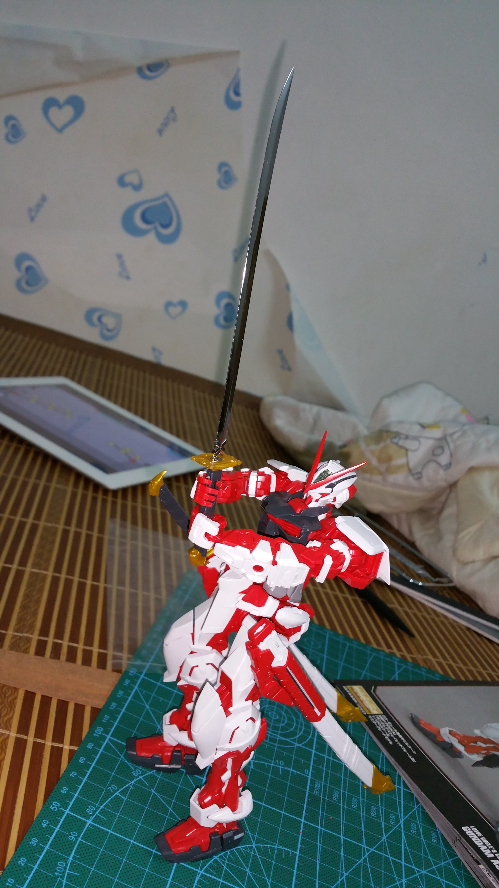
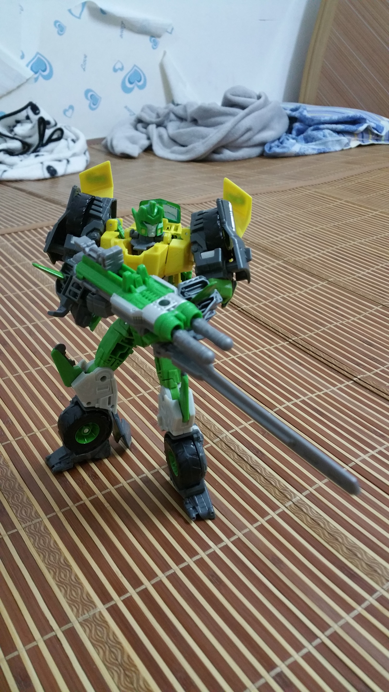
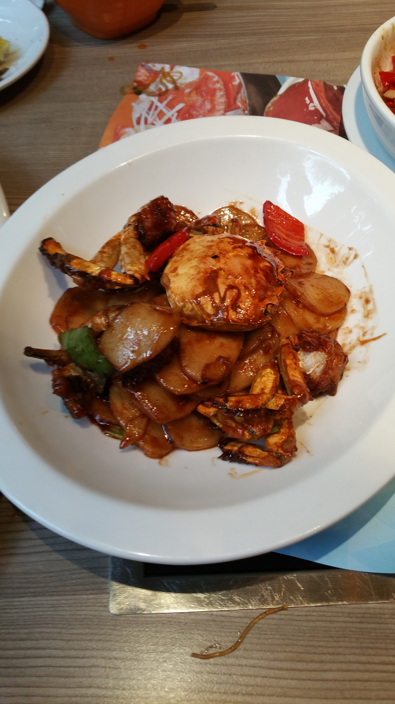

<!--{layout:default title:国庆假期后的杂想}-->

**注意：这篇文章是水文，没任何技术含量，只是吐吐槽，感慨感慨罢了！**

国庆假期就这么结束了，这十天假过的真是飞快(中秋后我请了3天假)，同时过的也是非常忙碌，N多人结婚，然后本人还顺路去看了甲天下的桂林山水、繁华的上海还有雨中的杭州西湖，旅途是如此精彩，但是礼金+路费+酒店+美食+游玩下来，半个月多月的工资可就没了T T。

同学结婚，遇到了好多好久不见的老同学，看着大家工作生活上都是欣欣向荣，步步高升，再看看自己，似乎觉得有些凄惨啊！总觉得工作上有各种烦心事，工作的内容跟我预想的也越差越远(也许是我心高气傲、眼高手低吧)，工作三年多了，遇到瓶颈，进入迷茫期了哎~

另外国庆这十天，github上的更新也断了，对一些项目的兴趣也渐渐淡了(毕竟写出的玩具没人start也没人fork~)，我也想开了，以后项目更新进度稍微缓一缓，有时间有兴致了，就专心码代码，同时也要抽出课余时间玩点其他的，比如最近我正在:

1. 鼓捣树莓派，树莓派的gpio控制LED啦，控制马达啦，能搞出个机器人来，那就不枉我花几百块买树莓派了;
2. 玩高达模型，红异端MG(正在拼)，全装备独角兽MG&报丧女妖MG&新安洲MG&00高达RG(已入手)，红蛇&黄狼(太贵了，有点舍不得)，战国红异端&蓝异端(准备买了)， 这些都是手艺活，专治我这种手残；

3. 变形金刚，作为一个大男孩，长大了，有工资了，可以圆小时候的梦了，剁手买了一些变形金刚玩具;

github上的项目也不会断的，只是进度放缓！

国庆假期结束了，该收收心了，利用年前的时间，好好巩固巩固之前的知识，多扩展一下知识面，准备明年做北漂一族吧！加油！

另外杭州的螃蟹真好吃~

